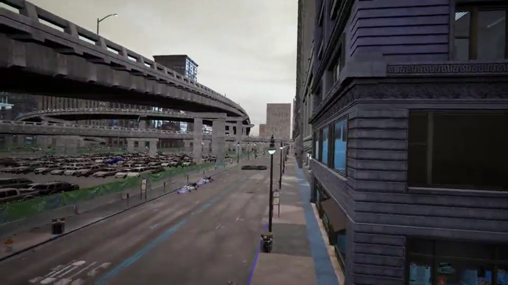
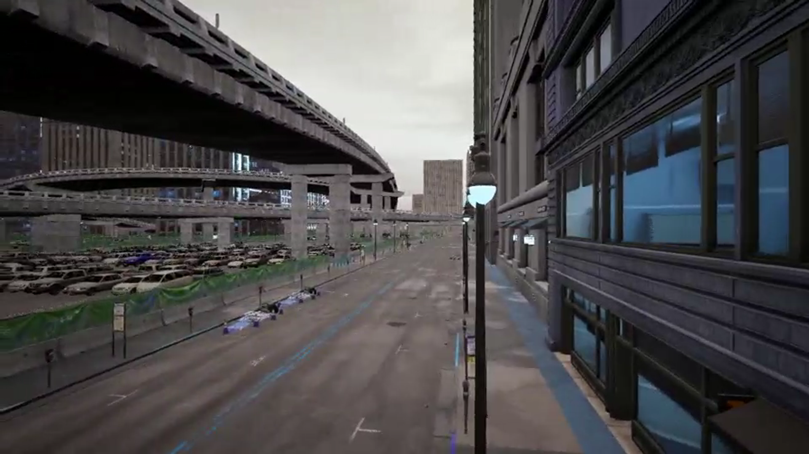

# ProjectAirSim UAV Inspection Baseline

<h4 align="center">
    <p>
        <a href="https://github.com/QinCheng0928/ProjectAirSim_UAV_Inspection_Baseline/blob/main/README.md">English</a> | 
        <b>简体中文</b>
    </p>
</h4>

本项目提供了一个基于随机策略的无人机自主巡检基线系统，能够在城市道路网络环境中进行简单的导航、避障以及图像采集。系统使用深度相机进行障碍物检测，并基于道路网络拓扑结构实现随机路径规划。

## 项目结构

```
ProjectAirSim_UAV_Inspection_Baseline/
├── main.py                          # 程序主入口
├── inspection.py                    # 巡检管理器主逻辑
├── config/
│   └── settings.py                  # 项目配置参数
├── models/
│   ├── intersection.py              # 道路交叉口数据模型
│   └── roadnetwork.py               # 道路网络拓扑管理
├── components/
│   ├── collision_handler.py         # 碰撞检测处理器
│   └── image_handler.py             # 图像处理和显示管理
├── docs/                            # 项目文档
└── media/                           # 视频文件输出目录
```

## 安装要求

- **Ubuntu 20.04**
- **Python 3.8**
- **Unreal Engine 5 (5.2)**
- **City Sample**
- **ProjectAirSim (v0.1.1)**

## 演示视频

#### 1. 跟随视角

[](https://qincheng0928.github.io/ProjectAirSim_UAV_Inspection_Baseline/docs/videos/chase_camera_demo.mp4)


#### 2. 前向视角

[](https://qincheng0928.github.io/ProjectAirSim_UAV_Inspection_Baseline//docs/videos/front_camera_demo.mp4)


#### 3. 深度相机视角

[](https://qincheng0928.github.io/ProjectAirSim_UAV_Inspection_Baseline//docs/videos/depth_camera_demo.mp4)


